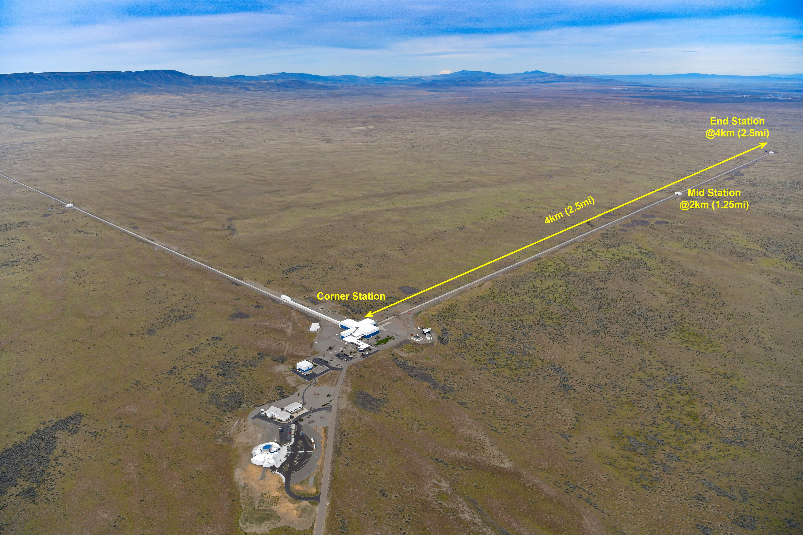
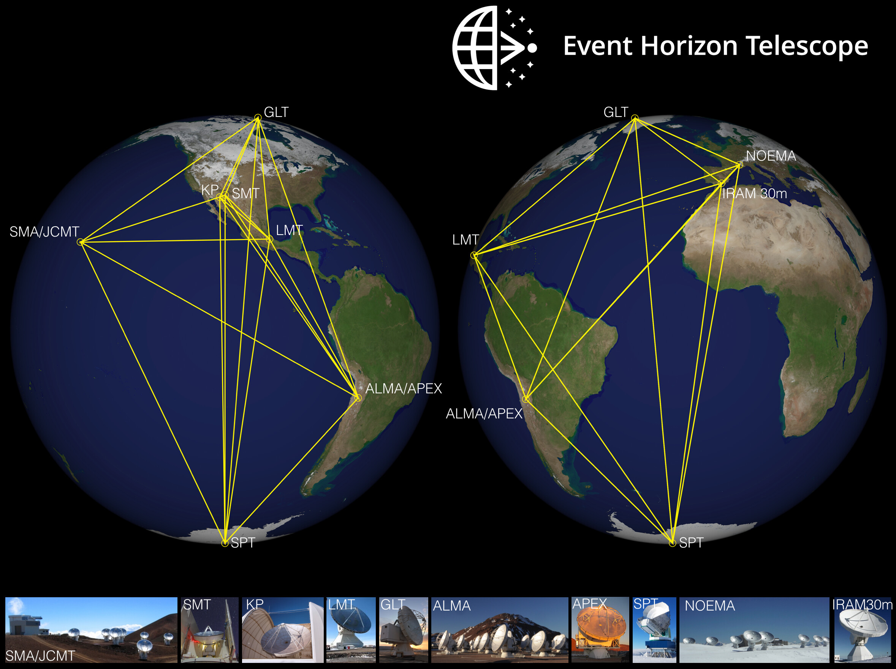

# Como Detectamos Buracos Negros

Como buracos negros não emitem luz, a sua detecção é feita através de alguns métodos distintos. Por métodos indiretos, medindo sua interferência em matéria próxima, por meio de ondas gravitacionais e mais recentemente, pelo imageamento de sua sombra, popularmente chamada de foto de um buraco negro.

> [!NOTE]
> O conceito de buraco negro é teorizado desde a publicação da 
> Teoria da Relatividade Geral mas só foi comprovada e medida pela 
> primeira vez em 1971, com telescopios de raios-X.

## Detecção dos Efeitos Sobre Estrelas Próximas

O forte campo gravitacional dos buracos negros atrai galáxias, estrelas e gás nas proximidades. Os astronomos conseguem observar, ao longo do tempo, que esses corpos orbitam um objeto massivo e invisivel. 
Em relação aos métodos utilizados, é possível medir as posições angulares e analisar a elipse orbital projetada no céu, obtendo dados de telescopios como o Telescopio Espacial Hubble ou telescopios terrestres.
Para testar a confiabilidade da inferencia, e evitar a confusão com um corpo orbitando uma estrela de nêutrons, o centro da orbita é medido. Caso o tamanho da órbita seja menor do que o limite teórico de estabilidade de um aglomerado denso, se conclui que o corpo orbita um buraco negro supermassivo[1].

---

## Detecção de Raios-X 
O disco de acreção de um buraco negro gira em alta velocidade ao seu redor. A fricção e gravidade fazem os gases do disco atingirem milhões de graus e emitirem radiação principalmente na faixa dos raios-X. Estes raios podem ser detectados com telescopios espaciais de raios-X como Chandra, XMM-Newton e NuSTAR[2].

---

## Detecção de Ondas Gravitacionais
Outra maneira em que astrônomos detectam os buracos negros é através da detecção de ondas gravitacionais. Quando dois deles se orbitam entre si e colidem, o resultado gera grandes ondas gravitacionais que viajam através do espaço-tempo.
As ondas gravitacionais são medidas através de interferômetros a laser como LIGO(EUA), Virgo(Italia) e GEO600 (Alemanha)[3].
Os interferômetros funcionam disparando um feixe de luz é dividido ao meio por um espelho semitransparente. Cada metade viaja por túneis perpendiculares de vários quilômetros de extensão, bate em um espelho e retorna. Normalmente cada feixe bate no espelho e retorna ao mesmo tempo no ponto de chegada. Caso uma onda gravitacional passe pela Terra os lasers saem de sincronia, pois a onda gravitacional estica e comprime o espaço tempo momentaneamente, tornando um dos túneis microscopicamente menor que o outro.

> [!NOTE]
> Esses detectores são tão sensíveis que captam até caminhões 
> passando na rodovia. Para não confundir trânsito com buraco negro
> os cientistas cruzam dados de vários observatórios pelo mundo: se 
> o sinal não aparecer em todos eles com a exata diferença de 
> milissegundos esperada, é descartado como ruído local.

Figura 1 - Imagem do Ligo. Fonte: Ligo/Caltech

---

## Detecção da Sombra de um Buraco Negro
A captura de um buraco negro é um desafio por não emitirem luz e sua distância em relação a Terra. Para resolver isso a colaboração do Event Horizon Telescope(EHT), juntou um time de todo o mundo para criar um telescopio virtual do tamanho da Terra. 
O EHT utiliza um método conhecido como “ interferometria de linha de base muito longa ” (VLBI), a técnica já era utilizada anteriormente mas nunca antes nessa escala. Os telescópios são sincronizados com relógios atômicos superprecisos e seus dados são cruzados em supercomputadores para gerar a imagem final. [4]

> [!NOTE]
> Os dados gerados pelo EHT eram tão massivos que era mais rápido 
> enviar toneladas de discos rígidos de avião para os 
> supercomputadores na Alemanha e nos EUA do que tentar transferir 
> tudo pela internet.

Figura 2 - Imagem dos telescopios que compõem o EHT. Fonte: Wikipedia.

---

# Referências: 

[1] SIOPIS, C. et al. A stellar dynamical measurement of the black hole mass in the maser galaxy NGC 4258. The Astrophysical Journal, v. 693, n. 1, p. 946, 2009. DOI: https://doi.org/10.1088/0004-637X/693/1/946.

[2] INOUE, H. X-ray observations of accretion disks. Publications of the Astronomical Society of Japan, v. 74, n. 1, p. R1-R25, 2022. DOI: https://doi.org/10.1093/pasj/psab066.

[3] ABBOTT, B. P. et al. Observation of Gravitational Waves from a Binary Black Hole Merger. Physical Review Letters, v. 116, n. 6, p. 061102, 2016. DOI: https://doi.org/10.1103/PhysRevLett.116.061102.

[4] EVENT HORIZON TELESCOPE COLLABORATION et al. First M87 Event Horizon Telescope Results. I. The Shadow of the Supermassive Black Hole. The Astrophysical Journal Letters, v. 875, n. 1, p. L1, 2019. DOI: https://doi.org/10.3847/2041-8213/ab0ec7.
