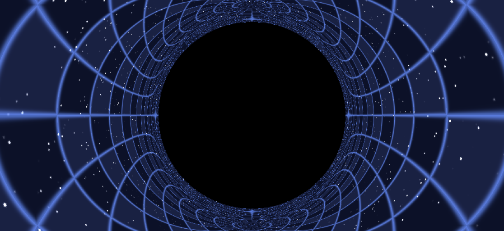
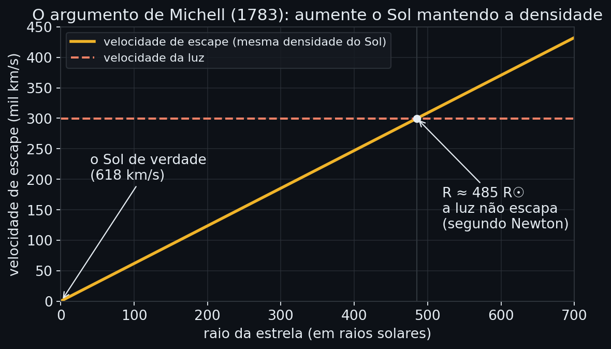
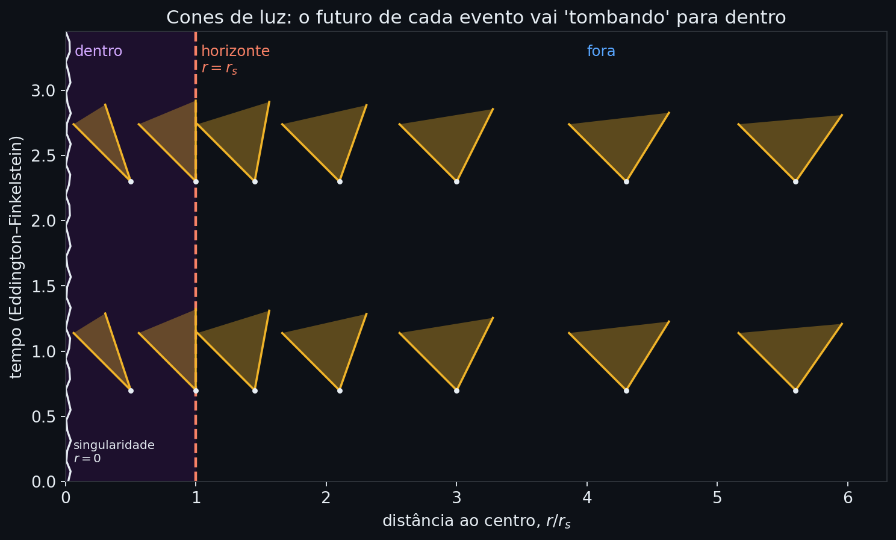
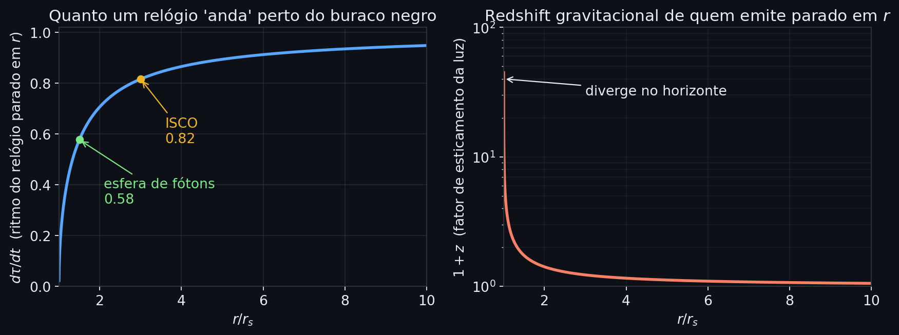
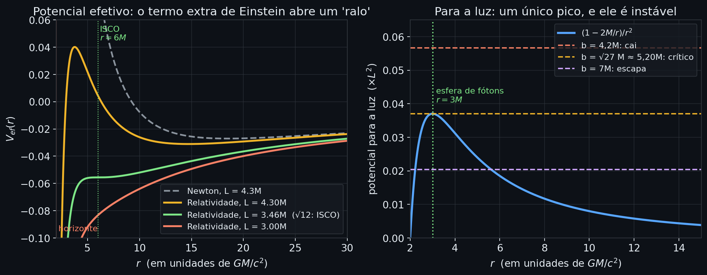
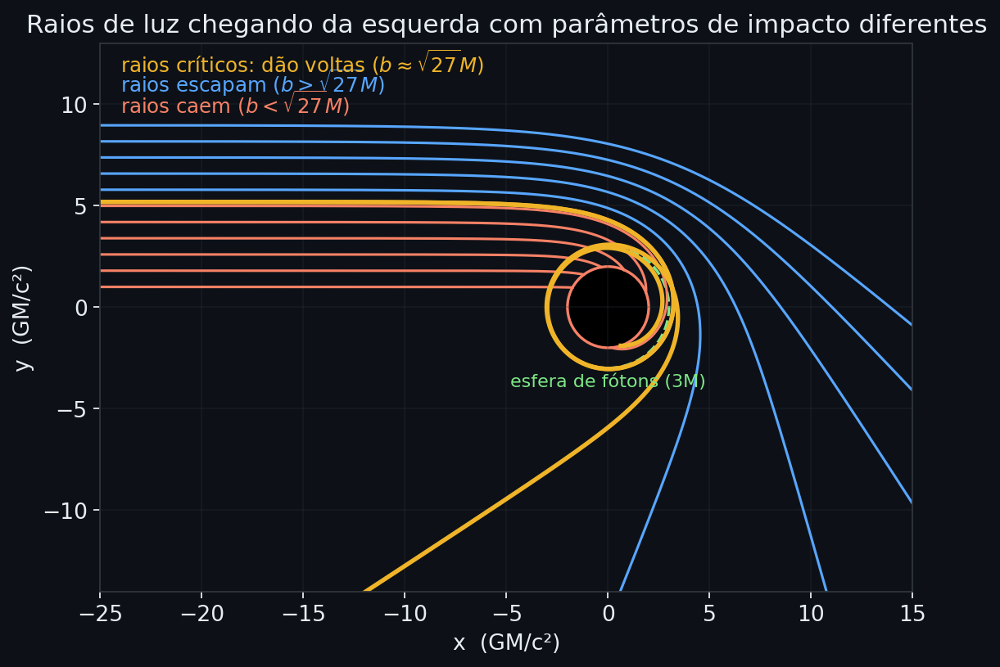
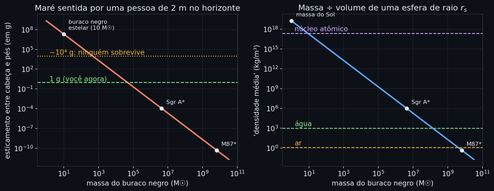
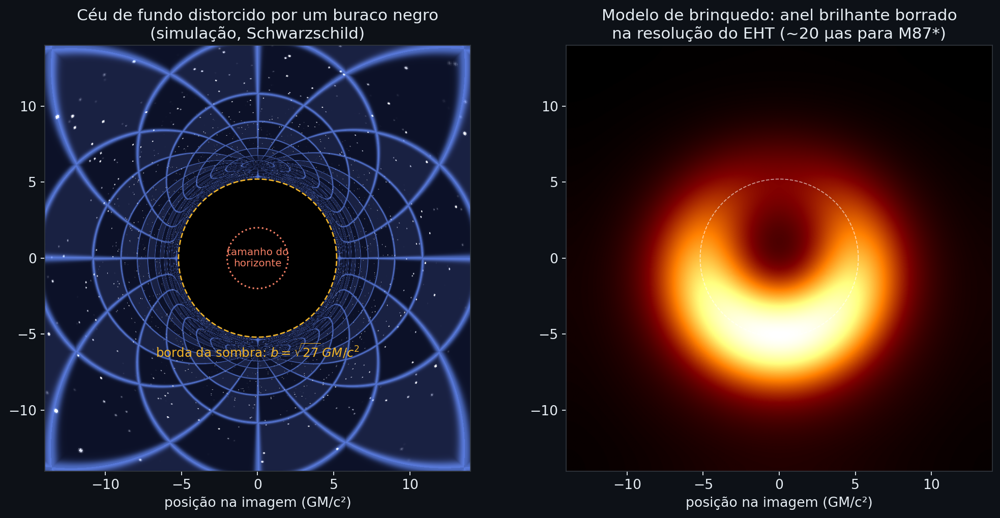

<p align="center">
  
</p>

# Buracos Negros: Horizonte de Eventos e Gravidade

<p align="center">
  <b>LUNA · grupo de estudos de astronomia</b><br>
  <sub>Material de pesquisa da área "horizonte de eventos e gravidade" · Gustavo Rech Costa</sub>
</p>

---

As demonstrações mais longas ficam dentro de blocos (📐).

---

## 1. Se o Sol virasse um buraco negro...

Se amanhã o Sol fosse espremido até virar um buraco negro, **com exatamente a mesma massa**, o que aconteceria com a órbita da Terra?

A resposta que vem é "a Terra seria sugada". Quando na verdade a resposta certa é bem menos cinematográfica: **nada**. A Terra continuaria no mesmo lugar, dando uma volta a cada 365 dias. A diferença é que, 8 minutos e 19 segundos depois, ficaria tudo escuro e bem frio.

O motivo é que, do lado de fora de um corpo esférico, a gravidade só depende da massa dele, não do tamanho. Newton já dizia isso (teorema das cascas). Na relatividade geral vale a mesma coisa, com outro nome: o **teorema de Birkhoff** diz que o espaço-tempo do lado de fora de qualquer distribuição esférica de massa é sempre o mesmo, o de Schwarzschild. A Terra está a 150 milhões de km. Pra ela, tanto faz se a massa do Sol ocupa 1,4 milhão de km de diâmetro ou 6 km.

```math
F = \frac{G M_\odot m_\oplus}{r^2}
\qquad\text{e}\qquad
T^2 = \frac{4\pi^2}{G M_\odot}\,a^3
```

Nenhuma das duas fórmulas tem o raio do Sol. Força igual, período igual.

O que muda de verdade é **o quão perto você consegue chegar da massa**. Hoje, se você se aproximar do Sol, bate na superfície a 696 mil km do centro. Em um Sol-buraco-negro, dá pra chegar a poucos quilômetros de toda aquela massa. É ali, bem perto, que a gravidade fica estranha.

### Quanto é preciso espremer?

O tamanho de um buraco negro sem rotação é dado pelo **raio de Schwarzschild**:

```math
r_s = \frac{2GM}{c^2}
```

| Objeto                         | Massa                         | $r_s$                       | Um comparativo                                               |
| ------------------------------ | ----------------------------- | --------------------------- | ------------------------------------------------------------ |
| Terra                          | $5{,}97\times10^{24}$ kg      | **8,9 mm**                  | uma bola de gude                                             |
| Sol                            | 1 $M_\odot$                   | **2,95 km**                 | uns 6 km de diâmetro, menor que muita cidade                 |
| Buraco negro estelar típico    | 10 $M_\odot$                  | **29,5 km**                 | uns 60 km de diâmetro, o tamanho de uma região metropolitana |
| Sgr A\* (centro da Via Láctea) | $4{,}15\times10^{6}\ M_\odot$ | **$1{,}2\times10^{7}$ km**  | ~18 raios solares, 1/5 da órbita de Mercúrio                 |
| M87\*                          | $6{,}5\times10^{9}\ M_\odot$  | **$1{,}9\times10^{10}$ km** | ~128 UA, mais de 3× a órbita de Plutão                       |

Repare que $r_s$ cresce **linearmente** com a massa. Isso vai ser importante, porque é a origem de dois números contra intuitivos.

<details>
<summary>📐 <b>Conta: raio de Schwarzschild do Sol e da Terra</b></summary>

<br>

Com $G = 6{,}674\times10^{-11}\ \text{m}^3\,\text{kg}^{-1}\text{s}^{-2}$ e $c = 2{,}998\times10^{8}\ \text{m/s}$:

```math
r_s^{\odot} = \frac{2\,(6{,}674\times10^{-11})(1{,}989\times10^{30})}{(2{,}998\times10^{8})^2}
= \frac{2{,}655\times10^{20}}{8{,}988\times10^{16}} \approx 2954\ \text{m}
```

```math
r_s^{\oplus} = \frac{2\,(6{,}674\times10^{-11})(5{,}972\times10^{24})}{8{,}988\times10^{16}} \approx 8{,}9\times10^{-3}\ \text{m}
```

Como $r_s \propto M$, o resto da tabela sai de uma regra de três: cada massa solar vale ~2,95 km.

</details>

> [!WARNING]
> **O Sol nunca vai virar buraco negro.** Pra isso o que sobra do núcleo depois da morte da estrela precisa passar de umas 3 massas solares, o que exige estrelas que nascem com bem mais massa que o Sol (algo na faixa de 20 $M_\odot$ ou mais). O Sol vai terminar como uma anã branca, daqui a uns 5 bilhões de anos.

---

## 2. O argumento de Newton: estrelas escuras

Muito antes de Einstein, alguém já tinha pensado em estrelas que não deixam a luz sair.

Em 1783, o inglês **John Michell** mandou uma carta a Henry Cavendish. O raciocínio era: se a luz é feita de partículas (como Newton achava), essas partículas deveriam sentir a gravidade como qualquer pedra. Uma estrela pesada o bastante seria capaz de segurar a própria luz. Em 1796, **Laplace** chegou à mesma ideia de forma independente.

A ferramenta é a **velocidade de escape**: a velocidade mínima pra jogar algo pra cima e nunca mais ver voltar. Ela sai de um balanço de energia: a energia cinética do lançamento tem que pagar toda a "dívida" de energia potencial.

```math
\frac{1}{2}mv_{esc}^2 - \frac{GMm}{R} = 0
\quad\Longrightarrow\quad
v_{esc} = \sqrt{\frac{2GM}{R}}
```

Qual raio faz $v_{esc}$ chegar em $c$?

```math
c = \sqrt{\frac{2GM}{R}}
\quad\Longrightarrow\quad
R = \frac{2GM}{c^2}
```

Exatamente o raio de Schwarzschild, 133 anos antes de Schwarzschild.

### O exemplo de Michell

Michell fez a conta da seguinte forma: manteve a densidade do Sol e foi aumentando o tamanho da estrela. Com densidade fixa, a massa cresce com $R^3$, então a velocidade de escape cresce **proporcional ao raio**. Ele concluiu que uma estrela com a densidade do Sol e mais ou menos 500 raios solares já seria escura.

<p align="center">
  
</p>

<details>
<summary>📐 <b>Demonstração: por que a velocidade de escape cresce com o raio</b></summary>

<br>

Com densidade $\rho$ constante, $M = \frac{4}{3}\pi\rho R^3$. Substituindo:

```math
v_{esc} = \sqrt{\frac{2G}{R}\cdot\frac{4}{3}\pi\rho R^3} = R\,\sqrt{\frac{8\pi G\rho}{3}} \;\propto\; R
```

O Sol tem $v_{esc} \approx 618$ km/s. Pra chegar em 300.000 km/s, o raio precisa crescer por um fator

```math
\frac{299\,792}{617{,}7} \approx 485
```

Ou seja, Michell estava certo com o seu "aproximados 500".

</details>

### A sacada de Michell

Michell foi além. Ele percebeu que essas estrelas seriam invisíveis, mas que **daria pra detectá-las pela gravidade**, se uma estrela brilhante estivesse orbitando uma delas. A órbita denunciaria uma massa enorme onde não se vê nada.

É exatamente assim que encontramos buracos negros hoje. Cygnus X-1, nos anos 1970, foi identificado por uma estrela azul girando em torno de um companheiro invisível pesado demais pra ser estrela de nêutrons. E a massa de Sgr A\* foi medida acompanhando por décadas as órbitas de estrelas no centro da galáxia, trabalho que rendeu o Nobel de Física de 2020 a Reinhard Genzel e Andrea Ghez.

### Onde o argumento de Newton falha

Aqui vale ser honesto: a "estrela escura" é um conceito diferente de um buraco negro.

1. **Na estrela escura, a luz sobe e cai de volta.** Um raio lançado da superfície sobe um pouco, para e volta, como uma bola. Alguém pairando um pouco acima da superfície conseguiria ver essa luz. Em um buraco negro, nenhum sinal de dentro do horizonte avança para fora.
2. **A luz não desacelera.** Na relatividade, qualquer observador local mede a luz passando a $c$, sempre. Não existe "a luz perdeu velocidade e caiu".
3. **A coincidência é acidental.** O cálculo newtoniano usa $\frac{1}{2}mv^2$ para a luz, o que não faz sentido na relatividade. O número bate, mas por motivos diferentes. Não dá pra usar isso como "prova" de nada.

---

## 3. O horizonte de eventos

No fim de 1915, semanas depois de Einstein apresentar as equações da relatividade geral, **Karl Schwarzschild** encontrou a solução exata das equações para o espaço-tempo em volta de uma massa esférica sem rotação. Ele fez isso enquanto servia no front russo da Primeira Guerra; o artigo saiu em 1916 e ele morreu poucos meses depois. A solução é esta:

```math
ds^2 = -\left(1-\frac{r_s}{r}\right)c^2\,dt^2
+ \left(1-\frac{r_s}{r}\right)^{-1}dr^2
+ r^2\left(d\theta^2+\sin^2\theta\,d\phi^2\right)
```

traduzindo:

- $ds^2$ é a "distância" no espaço-tempo entre dois eventos muito próximos.
- O **primeiro termo** diz como o tempo passa em cada lugar. O fator $(1 - r_s/r)$ é menor que 1 perto do buraco negro: o tempo anda mais devagar lá.
- O **segundo termo** diz como o espaço se estica na direção radial. O mesmo fator aparece invertido: perto do buraco negro, há "mais espaço" entre duas esferas do que a gente esperaria.
- O **terceiro termo** é a geometria de uma esfera comum. Detalhe importante: $r$ não é a distância até o centro. Ele é definido pela área: a esfera de "raio" $r$ tem área $4\pi r^2$.

Olhando a fórmula, duas coisas explodem: $r = 0$ e $r = r_s$.

### 3.1 O que ele é (e o que não é)

O jeito mais claro de entender o horizonte é pelo que ele **não** é.

**Não é uma superfície física.** Não tem parede, membrana, nem chão. Um astronauta caindo em um buraco negro, atravessa o horizonte sem sentir nada de especial naquele instante. Nenhum alarme toca. Ele só não tem mais como voltar.

**Não é onde a gravidade fica infinita.** O fator $1/(1 - r_s/r)$ explode em $r_s$ por culpa das coordenadas, não do espaço-tempo. É o mesmo tipo de problema das longitudes no Polo Norte: todas se encontram lá, mas ninguém que chega ao polo cai em um buraco. Pra saber se a curvatura é infinita de verdade, usamos uma quantidade que não depende de coordenadas, o escalar de Kretschmann:

```math
K = R_{abcd}R^{abcd} = \frac{12\,r_s^2}{r^6}
```

Em $r = r_s$, isso vale $12/r_s^4$
<br>
Em $r = 0$, explode.
<br>
**A singularidade real está no centro; o horizonte é um lugar comum do espaço.**

#### Por que não dá pra voltar?

Porque, lá dentro, **o $r$ vira tempo**. Quando $r < r_s$, o fator $(1 - r_s/r)$ fica negativo. Os sinais do primeiro e do segundo termo da métrica trocam de lugar. O papel que antes era do tempo (sempre avançar) passa a ser do $r$ (sempre diminuir).

Tentar ficar parado dentro de um buraco negro é como tentar não chegar em amanhã. O centro não está "lá embaixo"; ele está **no seu futuro**.

<p align="center">
  
</p>

<p align="center"><sub>Cada triângulo mostra pra onde a luz pode ir a partir daquele ponto. Longe, há caminhos pra fora e pra dentro. No horizonte, o "pra fora" fica parado. Lá dentro, até o raio de luz que aponta "pra fora" se move pra dentro.</sub></p>

<details>
<summary>📐 <b>Demonstração: dentro do horizonte, todo caminho leva a r menor</b></summary>

<br>

Chame $f(r) = 1 - r_s/r$. Para qualquer coisa com massa, o intervalo é do tipo tempo: $ds^2 < 0$.

```math
-f\,c^2\,dt^2 + \frac{dr^2}{f} + r^2\,d\Omega^2 < 0
```

Dentro do horizonte, $f < 0$. Então $-f\,c^2dt^2 \ge 0$ e $r^2 d\Omega^2 \ge 0$. O único termo que pode deixar a soma negativa é $dr^2/f$, que é negativo. Logo:

```math
\frac{dr^2}{|f|} > |f|\,c^2dt^2 + r^2\,d\Omega^2 \;\ge\; 0
\quad\Longrightarrow\quad dr \neq 0
```

Ficar com $r$ constante é impossível. Como o movimento é contínuo, $r$ só pode ir em um sentido, e esse sentido é $r$ diminuindo.

</details>

#### Quanto tempo dura a queda lá dentro?

Para quem cai, o tempo próprio entre cruzar o horizonte e chegar à singularidade é **no máximo**

```math
\tau_{max} = \frac{\pi G M}{c^3}
```

| Buraco negro | $\tau_{max}$      |
| ------------ | ----------------- |
| 1 $M_\odot$  | 15 microssegundos |
| 10 $M_\odot$ | 0,15 milissegundo |
| Sgr A\*      | ~64 segundos      |
| M87\*        | ~28 horas         |

Ligar os motores só piora: qualquer aceleração encurta esse tempo. No buraco negro de M87 daria pra tomar café, almoçar e jantar lá dentro. Mas o fim é o mesmo.

### 3.2 Dilatação do tempo e redshift

Pegue a métrica e imagine um relógio **parado** a uma distância $r$ (pairando com foguete, sem cair). Parado quer dizer $dr = d\theta = d\phi = 0$. Sobra só o primeiro termo:

```math
ds^2 = -c^2 d\tau^2 = -\left(1-\frac{r_s}{r}\right)c^2\,dt^2
\quad\Longrightarrow\quad
d\tau = \sqrt{1-\frac{r_s}{r}}\;dt
```

Aqui $d\tau$ é o tempo que o relógio parado mede e $dt$ é o tempo de um relógio muito longe. Como a raiz é menor que 1, **o relógio perto do buraco negro anda mais devagar**. No horizonte, a raiz vai a zero.

Acontece no nosso celular. Os satélites de GPS estão mais longe da Terra que nós, então os relógios deles adiantam uns **45 microssegundos por dia** por causa da gravidade. A velocidade deles atrasa uns 7 μs/dia, ou seja, um saldo de cerca de **+38 μs por dia**. Parece nada, mas como a luz anda 300 m por microssegundo, sem essa correção o GPS acumularia erros de quilômetros por dia.

<details>
<summary>📐 <b>Conta: os 45 μs/dia do GPS</b></summary>

<br>

Longe de um buraco negro, $r_s/r$ é minúsculo e dá pra usar $\sqrt{1-x}\approx 1 - x/2$:

```math
\frac{d\tau}{dt} \approx 1 - \frac{GM}{rc^2}
```

Para a Terra, $GM_\oplus/c^2 \approx 4{,}44$ mm. Na superfície ($r = 6371$ km) isso dá $6{,}96\times10^{-10}$; na órbita do GPS ($r \approx 26\,560$ km), $1{,}67\times10^{-10}$. A diferença, $5{,}29\times10^{-10}$, multiplicada pelos 86.400 s de um dia:

```math
5{,}29\times10^{-10}\times 86\,400\ \text{s} \approx 45{,}7\ \mu\text{s}
```

</details>

#### Redshift gravitacional

A luz é um relógio: cada crista de onda é um "tique". Se um emissor parado em $r$ manda ondas com frequência $\nu_{em}$, quem está longe recebe as mesmas cristas, só que espaçadas pelo tempo de longe. Resultado: a luz chega com frequência menor, ou seja, **mais vermelha**.

```math
\frac{\nu_\infty}{\nu_{em}} = \sqrt{1-\frac{r_s}{r}}
\qquad\Longrightarrow\qquad
1+z = \frac{1}{\sqrt{1-\frac{r_s}{r}}}
```

<p align="center">
  
</p>

Um detalhe: em $r = 3r_s$ (onde fica a ISCO, seção 4) o relógio parado ainda anda a 82% do ritmo de longe.

#### E se eu ficar vendo uma pessoa cair?

Do ponto de vista da pessoa, ela cruza o horizonte em um tempo finito e segue para o centro. Do seu ponto de vista, a imagem dela vai ficando cada vez mais lenta e mais vermelha, e **nunca** chega a cruzar.

Mas o "congelado pra sempre na borda" é mais teórico. O redshift da imagem dela cresce exponencialmente, com um tempo característico de:

```math
t_e = \frac{2r_s}{c} = \frac{4GM}{c^3}
```

Para um buraco negro de 1 $M_\odot$, isso é 20 microssegundos. Em menos de um milissegundo a imagem já sumiu de qualquer detector. Para Sgr A*, ~80 s; para M87*, ~36 horas.

<details>
<summary>📐 <b>Demonstração: o relógio de quem orbita em círculo</b></summary>

<br>

Use unidades com $G = c = 1$. Numa órbita circular, $dr = 0$ e $\theta = \pi/2$:

```math
d\tau^2 = \left(1-\frac{2M}{r}\right)dt^2 - r^2\,d\phi^2
```

Um fato surpreendente da solução de Schwarzschild: a terceira lei de Kepler vale **exatamente** usando o tempo $t$ de quem está longe, $\Omega = d\phi/dt = \sqrt{M/r^3}$. Dividindo tudo por $dt^2$:

```math
\left(\frac{d\tau}{dt}\right)^2 = 1 - \frac{2M}{r} - r^2\cdot\frac{M}{r^3} = 1 - \frac{3M}{r}
```

Em $r = 6M$, dá $\sqrt{1/2}$. Em $r = 3M$, dá zero, o que já é uma pista do que acontece na esfera de fótons.

</details>

---

## 4. A gravidade: onde Newton quebra

Longe do buraco negro, a relatividade geral e Newton dão praticamente a mesma resposta. É por isso que usamos Newton pra mandar sondas a Júpiter sem problema. Chegando perto, aparecem três coisas que Newton simplesmente não tem:

1. existe um raio abaixo do qual **nenhuma órbita estável é possível**;
2. existe um raio onde **a própria luz pode orbitar**;
3. ter momento angular **não garante mais** que você não cai.

As três saem de uma mesma ferramenta.

### 4.1 Potencial efetivo

A ideia do potencial efetivo é transformar um movimento em duas dimensões, em um problema de uma dimensão só: uma bolinha rolando no trilho com altura $V(r)$. Onde o trilho sobe, a bolinha freia; onde desce, acelera.

**Em Newton**, a energia por unidade de massa de um corpo em órbita é

```math
\frac{1}{2}\dot r^2 + V_N(r) = \varepsilon,
\qquad
V_N(r) = -\frac{GM}{r} + \frac{L^2}{2r^2}
```

em que $L$ é o momento angular por unidade de massa. O primeiro termo puxa pra dentro. O segundo é a **barreira centrífuga**, e repare: quando $r \to 0$, ele vai a $+\infty$ mais rápido que o primeiro vai a $-\infty$. Resultado: em Newton, qualquer momento angular, por menor que seja, impede você de chegar ao centro. É por isso que a Terra não cai no Sol.

**Na relatividade geral**, fazendo a conta com a métrica de Schwarzschild, aparece um termo a mais:

```math
V_{ef}(r) = -\frac{GM}{r} + \frac{L^2}{2r^2} \;\underbrace{-\; \frac{GM\,L^2}{c^2\,r^3}}_{\text{novo}}
```

Três observações sobre esse termo novo:

- Ele tem $c^2$ no denominador. Se a luz fosse infinitamente rápida, ele sumiria e voltaríamos a Newton. É assim que a relatividade "contém" Newton.
- Ele é **negativo**: puxa pra dentro, igual à gravidade.
- Ele vai com $1/r^3$, que cresce mais rápido que o $1/r^2$ da barreira centrífuga. Longe, quase não aparece. Perto, ele **vence**.

Ou seja: a barreira centrífuga agora tem um topo. Se você tiver energia pra passar por cima, não tem mais nada te segurando. Você cai.

<p align="center">
  
</p>

<p align="center"><sub>Esquerda: a curva tracejada é Newton, que sobe pra sempre perto do centro. As cheias são a relatividade, todas despencando no horizonte. Direita: o mesmo raciocínio para a luz.</sub></p>

<details>
<summary>📐 <b>Demonstração: de onde sai o termo extra</b></summary>

<br>

Em unidades com $G = c = 1$ e no plano $\theta = \pi/2$. A métrica não depende de $t$ nem de $\phi$, e isso dá duas quantidades conservadas ao longo da queda livre (o ponto indica derivada no tempo próprio $\tau$):

```math
E = \left(1-\frac{2M}{r}\right)\dot t
\qquad\qquad
L = r^2\,\dot\phi
```

$E$ faz o papel de energia por unidade de massa e $L$ de momento angular. Para uma partícula com massa, $ds^2 = -d\tau^2$, então

```math
-1 = -\left(1-\frac{2M}{r}\right)\dot t^2 + \left(1-\frac{2M}{r}\right)^{-1}\dot r^2 + r^2\dot\phi^2
```

Multiplicando tudo por $(1 - 2M/r)$ e trocando $\dot t$ e $\dot\phi$ por $E$ e $L$:

```math
\dot r^2 = E^2 - \left(1-\frac{2M}{r}\right)\left(1+\frac{L^2}{r^2}\right)
```

Abrindo o produto e dividindo por 2:

```math
\frac{1}{2}\dot r^2
\;\underbrace{-\;\frac{M}{r} + \frac{L^2}{2r^2} - \frac{M L^2}{r^3}}_{V_{ef}(r)}
= \frac{E^2-1}{2}
```

É exatamente a forma de Newton com o termo $-ML^2/r^3$ a mais. Devolvendo as constantes, ele vira $-GML^2/(c^2r^3)$.

</details>

Esse termo pequenininho faz com que órbitas elípticas não fechem: a elipse vai girando devagar. No Sistema Solar, quem sente mais é Mercúrio, por estar mais perto do Sol. A previsão é

```math
\Delta\phi = \frac{6\pi G M_\odot}{c^2\,a\,(1-e^2)} \approx 5{,}0\times10^{-7}\ \text{rad por órbita}
```

Em um século Mercúrio dá aproximadamente 415 voltas, o que acumula **43 segundos de arco**. Esse desvio era conhecido desde o século XIX e ninguém conseguia explicar com Newton. Einstein calculou em 1915 e bateu. Foi o primeiro grande teste da teoria.

### 4.2 Esfera de fótons e ISCO

#### A esfera de fótons: onde a luz anda em círculos

Para a luz, o raciocínio é o mesmo, com uma diferença: ela não tem massa, então $ds^2 = 0$. A equação fica

```math
\left(\frac{dr}{d\lambda}\right)^2 + \frac{L^2}{r^2}\left(1-\frac{2M}{r}\right) = E^2
```

Dividindo por $L^2$, aparece uma grandeza com cara física: $b = L/E$, o **parâmetro de impacto**. É a distância que o raio de luz passaria do centro se não houvesse gravidade nenhuma. O destino do raio depende só de $b$:

```math
\frac{1}{L^2}\left(\frac{dr}{d\lambda}\right)^2 + \underbrace{\frac{1}{r^2}\left(1-\frac{2M}{r}\right)}_{W(r)} = \frac{1}{b^2}
```

$W(r)$ tem um único pico, em $r = 3M$ (gráfico da direita acima). Se $1/b^2$ passa por cima do pico, a luz cai. Se fica por baixo, a luz bate na "lombada" e volta pro infinito, desviada. Bem no limite, ela fica **orbitando em círculo**. Essa é a esfera de fótons.

<details>
<summary>📐 <b>Demonstração: r = 3M e o parâmetro de impacto crítico</b></summary>

<br>

O pico de $W(r) = r^{-2} - 2Mr^{-3}$ fica onde a derivada zera:

```math
W'(r) = -\frac{2}{r^3} + \frac{6M}{r^4} = 0
\quad\Longrightarrow\quad
r = 3M = \frac{3}{2}\,r_s
```

O valor do pico é

```math
W(3M) = \frac{1}{9M^2}\left(1 - \frac{2}{3}\right) = \frac{1}{27M^2}
```

A luz fica presa exatamente quando $1/b^2 = 1/(27M^2)$, ou seja,

```math
b_c = \sqrt{27}\,M = 3\sqrt{3}\,\frac{GM}{c^2} \approx 5{,}196\,\frac{GM}{c^2}
```

</details>

<p align="center">
  
</p>

<p align="center"><sub>Raios de luz vindos da esquerda (calculados numericamente). Abaixo de b = √27 M eles caem; acima, escapam desviados. Os dois amarelos estão a 0,0005 M do valor crítico: um dá a volta e escapa pra trás, o outro dá a volta e cai.</sub></p>

Três coisas curiosas sobre a esfera de fótons:

- **Ela é instável**, como um lápis equilibrado. Qualquer perturbação, e o fóton ou cai ou escapa. Por isso ela não "acumula" luz.
- Um observador pairando ali e olhando para o lado veria, em princípio, **a própria nuca**: a luz que sai das costas dele dá a volta completa.
- Um corpo com massa só conseguiria orbitar em $r = 3M$ a velocidade da luz, o que é proibido. Então matéria nenhuma orbita ali.

#### A ISCO: a última órbita estável

Para corpos com massa, órbitas circulares ficam nos pontos onde o potencial efetivo é plano, $dV_{ef}/dr = 0$. Elas são **estáveis** quando estão num vale (um empurrãozinho e o corpo volta) e **instáveis** quando estão em uma "lombada".

Em Newton, toda órbita circular é estável, em qualquer raio. Na relatividade, abaixo de $r = 6M$ (três vezes o raio do horizonte) não existe mais vale nenhum. Essa fronteira tem nome: **ISCO**, de _innermost stable circular orbit_, a órbita circular estável mais interna.

<details>
<summary>📐 <b>Demonstração: por que exatamente 6M</b></summary>

<br>

Derivando $V_{ef} = -M/r + L^2/(2r^2) - ML^2/r^3$ e igualando a zero:

```math
\frac{M}{r^2} - \frac{L^2}{r^3} + \frac{3ML^2}{r^4} = 0
\quad\xrightarrow{\;\times r^4\;}\quad
M r^2 - L^2 r + 3ML^2 = 0
```

É uma equação do segundo grau em $r$. Ela tem duas raízes (um vale, que é a órbita estável, e uma "lombada", a instável) só se o discriminante for positivo:

```math
L^4 - 12M^2L^2 \ge 0
\quad\Longrightarrow\quad
L^2 \ge 12M^2
```

No limite $L^2 = 12M^2$, as duas raízes se juntam, o vale e a "lombada" se fundem e somem. Isso acontece em

```math
r = \frac{L^2}{2M} = \frac{12M^2}{2M} = 6M = 3\,r_s
```

É a curva verde do gráfico do potencial: ela tem um patamar achatado bem em $6M$. Abaixo disso, qualquer órbita circular é uma "lombada".

</details>

Isso tem uma consequência astrofísica enorme. O gás que gira em volta de um buraco negro (o **disco de acreção**) vai perdendo energia por atrito e espiralando pra dentro devagar. Ao chegar na ISCO: ele mergulha. Tudo o que ele irradiou até ali é a energia de ligação da ISCO, que dá para calcular:

```math
E_{ISCO} = \sqrt{\frac{8}{9}} \approx 0{,}943
\quad\Longrightarrow\quad
\text{energia liberada} \approx 1 - 0{,}943 = 5{,}7\%\ \text{de } mc^2
```

Pra comparar, a fusão de hidrogênio em hélio (o que faz o Sol brilhar) libera só **0,7%**. Cair em um buraco negro é oito vezes mais eficiente que fusão nuclear. É por isso que quasares, alimentados por buracos negros, estão entre os objetos mais luminosos do universo. (Em buracos negros girando rápido, a ISCO chega mais perto e a eficiência pode passar de 30%.)

Um corpo na ISCO passa, visto por um observador parado ali, a **metade da velocidade da luz**. Na esfera de fótons, a $c$.

#### A régua do buraco negro (sem rotação)

| Raio                        | Em $r_s$        | O que acontece ali                                                    |
| --------------------------- | --------------- | --------------------------------------------------------------------- |
| $0$                         | $0$             | singularidade (a teoria para de funcionar)                            |
| $2M$                        | $1$             | **horizonte de eventos**                                              |
| $3M$                        | $1{,}5$         | **esfera de fótons**: a luz orbita (instável)                         |
| $\sqrt{27}M \approx 5{,}2M$ | $\approx 2{,}6$ | raio aparente da **sombra** (é um parâmetro de impacto, não um lugar) |
| $6M$                        | $3$             | **ISCO**: a última órbita estável; borda interna do disco             |

---

## 5. Números contra intuitivos: maré e densidade

Lembra que $r_s$ cresce proporcional à massa? Essa linha simples tem duas consequências que bagunçam a intuição: **buracos negros maiores são mais "gentis" no horizonte, e menos densos.**

### Maré: o que realmente mata

O que despedaça alguém perto de um buraco negro não é a gravidade em si, é a **diferença** de gravidade entre a cabeça e os pés. Se os pés estão mais perto, são puxados com mais força. O corpo é esticado no comprimento e espremido dos lados. Os astrônomos chamam isso, com toda a seriedade, de **espaguetificação**.

A aceleração newtoniana é $a = GM/r^2$. A diferença ao longo de um corpo de comprimento $\ell$ é aproximadamente a derivada vezes $\ell$:

```math
\Delta a \approx \left|\frac{da}{dr}\right|\ell = \frac{2GM\,\ell}{r^3}
```

(Perto do horizonte, a conta completa da relatividade dá o mesmo resultado para quem cai radialmente. Coincidência que simplifica a vida.)

Agora coloque essa pessoa **no horizonte**, $r = r_s = 2GM/c^2$:

```math
\Delta a_{horizonte} = \frac{2GM\,\ell}{\left(2GM/c^2\right)^3} = \frac{c^6\,\ell}{4\,G^2M^2} \;\propto\; \frac{1}{M^2}
```

A massa está no **denominador**, ao quadrado. Quanto maior o buraco negro, mais suave é a maré no horizonte.

Para uma pessoa de 2 m:

| Buraco negro | Maré no horizonte     | Tradução                                                     |
| ------------ | --------------------- | ------------------------------------------------------------ |
| 1 $M_\odot$  | ~$2\times10^{9}\ g$   | vira espaguete muito antes de chegar                         |
| 10 $M_\odot$ | ~$2\times10^{7}\ g$   | idem; a 3.800 km do centro já são ~10 $g$                    |
| Sgr A\*      | ~$10^{-4}\ g$         | você não perceberia                                          |
| M87\*        | ~$5\times10^{-11}\ g$ | menos que a maré, que a própria Terra faz no seu corpo agora |

<details>
<summary>📐 <b>Conta: os números da tabela</b></summary>

<br>

Para $M = 10\,M_\odot = 1{,}989\times10^{31}$ kg e $\ell = 2$ m:

```math
\Delta a = \frac{(2{,}998\times10^{8})^6 \times 2}{4\,(6{,}674\times10^{-11})^2(1{,}989\times10^{31})^2}
\approx \frac{1{,}45\times10^{51}}{7{,}05\times10^{42}} \approx 2{,}1\times10^{8}\ \text{m/s}^2
```

Dividindo por $g = 9{,}81$ m/s², dá ~$2\times10^7\ g$. Os outros saem pela regra $\Delta a \propto 1/M^2$. Para Sgr A\*, multiplica-se por $(10/4{,}15\times10^6)^2 \approx 5{,}8\times10^{-12}$, chegando a ~$1{,}2\times10^{-3}$ m/s².

Para achar onde a maré passa de ~100 m/s² (uns 10 $g$) no buraco negro de 10 $M_\odot$:

```math
r = \left(\frac{2GM\ell}{\Delta a}\right)^{1/3} = \left(\frac{2\,(1{,}327\times10^{21})(2)}{100}\right)^{1/3} \approx 3{,}8\times10^{6}\ \text{m}
```

Ou seja, 3.800 km, mais de 100 vezes o raio do horizonte.

</details>

> [!CAUTION]
> Atravessar o horizonte de um buraco negro supermassivo sem sentir nada **não** quer dizer escapar da espaguetificação. Lá dentro, a maré continua crescendo como $1/r^3$ e fica infinita na singularidade. Só muda o momento em que ela chega em você.

### Densidade: um buraco negro mais leve que o ar

Agora uma conta de brincadeira. Divida a massa pelo "volume" de uma esfera de raio $r_s$:

```math
\rho = \frac{M}{\frac{4}{3}\pi r_s^3} = \frac{M}{\frac{4}{3}\pi\left(\frac{2GM}{c^2}\right)^3} = \frac{3c^6}{32\pi G^3 M^2} \;\propto\; \frac{1}{M^2}
```

De novo $M^2$ no denominador. O volume cresce mais rápido que a massa.

| Buraco negro                 | "Densidade média"          | Comparação                                   |
| ---------------------------- | -------------------------- | -------------------------------------------- |
| 1 $M_\odot$                  | $1{,}8\times10^{19}$ kg/m³ | ~80× a densidade de um núcleo atômico        |
| Sgr A\*                      | ~$10^{6}$ kg/m³            | mil vezes a água                             |
| $1{,}4\times10^{8}\ M_\odot$ | $10^{3}$ kg/m³             | **a densidade da água**                      |
| M87\*                        | ~0,4 kg/m³                 | **o ar na altitude de cruzeiro de um avião** |

<p align="center">
  
</p>

> [!WARNING]
> **Leve esse número com cuidado.** "Densidade" aqui é só um jeito de visualizar a escala. O interior de um buraco negro não é uma bola cheia de matéria espalhada, e "volume" dentro de um espaço-tempo tão curvo nem tem uma definição única (o $r$ não é a distância até o centro, lembra?). O que a conta mostra de verdade é que **não é preciso densidade absurda pra formar um buraco negro, se houver massa suficiente**. É uma ideia útil para entender como buracos negros supermassivos podem se formar.

---

## 6. A sombra: o que conseguimos ver do horizonte

Em abril de 2019, a colaboração **Event Horizon Telescope (EHT)** divulgou a primeira imagem de um buraco negro, o M87*, no centro da galáxia Messier 87, a uns 55 milhões de anos-luz. Em 2022 veio a de Sgr A*, o nosso.

<p align="center">
  
</p>

A primeira coisa a dizer sobre essa imagem: **ela não é uma foto do horizonte**. O horizonte não emite nada e não reflete nada. O que vemos é gás muito quente brilhando em volta, e uma região escura no meio. Essa região escura é a **sombra**.

### Por que a sombra é maior que o horizonte?

Volte à seção 4.2. Qualquer raio de luz que passe com parâmetro de impacto menor que $b_c = \sqrt{27}\,GM/c^2$ é capturado. Agora inverta o raciocínio: se você olha pro buraco negro e traça o caminho de volta de cada raio que chega no seu olho, **todos os que chegariam com $b < b_c$ terminam no horizonte**. Dessas direções não vem luz nenhuma de trás. Elas formam um disco escuro no céu.

O raio desse disco não é $r_s$. É $b_c$:

```math
\frac{b_c}{r_s} = \frac{\sqrt{27}\,GM/c^2}{2\,GM/c^2} = \frac{\sqrt{27}}{2} \approx 2{,}6
```

A gravidade age como uma lente de aumento sobre si mesma. A sombra aparece **2,6 vezes maior** que o horizonte.

<p align="center">
  
</p>

<p align="center"><sub>Esquerda: um céu quadriculado e estrelado visto através de um buraco negro, calculado com os desvios reais da luz em Schwarzschild. O círculo pontilhado vermelho é o tamanho "verdadeiro" do horizonte. Direita: um modelo (não é física completa) de um anel brilhante borrado até a resolução do EHT.</sub></p>

Na imagem da esquerda dá pra ver outras coisas da seção 4. Perto da borda da sombra, as linhas do céu se espremem em anéis cada vez mais finos: são imagens do céu inteiro feitas por luz que deu meia volta, uma volta, uma volta e meia em torno da esfera de fótons. Em princípio, há infinitas cópias do universo ali, cada uma mais fina que a anterior.

### Dá pra prever o tamanho antes de olhar?

Dá. Esse é o ponto mais bonito da história toda. O diâmetro angular da sombra visto de uma distância $D$ é

```math
\theta_{sombra} = \frac{2\,b_c}{D} = \frac{2\sqrt{27}\,GM}{c^2\,D}
```

Só precisa da massa e da distância, ambas medidas antes, de outros jeitos.

|             | Massa                         | Distância | Previsão     | Medido pelo EHT (anel) |
| ----------- | ----------------------------- | --------- | ------------ | ---------------------- |
| **M87\***   | $6{,}5\times10^{9}\ M_\odot$  | 16,8 Mpc  | **≈ 40 μas** | 42 ± 3 μas             |
| **Sgr A\*** | $4{,}15\times10^{6}\ M_\odot$ | 8,18 kpc  | **≈ 52 μas** | 51,8 ± 2,3 μas         |

(μas = microssegundo de arco, um milionésimo de segundo de arco, ou 1/3.600.000.000 de grau.)

<details>
<summary>📐 <b>Conta: o tamanho angular de M87*</b></summary>

<br>

Primeiro, $GM/c^2$ para M87\*: cada massa solar vale ~1477 m, então

```math
\frac{GM}{c^2} = 6{,}5\times10^{9}\times 1477\ \text{m} \approx 9{,}6\times10^{12}\ \text{m}
```

O diâmetro da sombra é $2\sqrt{27}$ vezes isso:

```math
2\,b_c = 2\times 5{,}196\times 9{,}6\times10^{12} \approx 1{,}0\times10^{14}\ \text{m}
```

A distância: $16{,}8\ \text{Mpc} = 16{,}8\times10^6\times3{,}086\times10^{16}\ \text{m} \approx 5{,}18\times10^{23}$ m. Então

```math
\theta = \frac{1{,}0\times10^{14}}{5{,}18\times10^{23}} \approx 1{,}93\times10^{-10}\ \text{rad}
```

Convertendo ($1\ \text{rad} \approx 2{,}063\times10^{11}\ \mu\text{as}$): $\theta \approx 40\ \mu\text{as}$.

</details>

Pra ter noção de quão pequeno é isso: 40 μas é o tamanho aparente de um **cartão de crédito na superfície da Lua**, visto daqui.

E por que precisou de um telescópio do tamanho da Terra? Porque a resolução de um telescópio é limitada pela razão entre o comprimento de onda e o tamanho da antena:

```math
\theta_{min} \approx \frac{\lambda}{D_{antena}} = \frac{1{,}3\ \text{mm}}{12\,700\ \text{km}} \approx 1\times10^{-10}\ \text{rad} \approx 21\ \mu\text{as}
```

Com rádio de 1,3 mm, só uma antena do diâmetro da Terra chega perto dos 20 μas. O EHT "fabrica" essa antena juntando radiotelescópios espalhados pelo planeta, sincronizados por relógios atômicos. Foram tantos dados que era mais rápido mandar os HDs de avião do que pela internet.

### O que a imagem mostra, e o que não mostra

- **O anel brilhante** é luz do gás quente, desviada pela gravidade. A posição dele é dominada pela geometria ($b_c$), e é por isso que dá pra comparar com a previsão.
- **O lado de baixo é mais brilhante** porque o gás gira, e a parte que vem na nossa direção tem a luz reforçada pelo efeito Doppler relativístico. O modelo de brinquedo acima imita isso.
- **O escuro do meio** não é exatamente $b_c$. Quanto da sombra aparece escura depende de onde o gás brilha (se tiver gás na frente do buraco negro, ele "preenche" um pouco). A borda é robusta; o interior depende do modelo.
- **Buracos negros reais giram.** A solução para isso é a de Kerr, e nela a sombra fica levemente achatada e deslocada. Mas o tamanho muda só alguns por cento, então a comparação acima continua valendo.

---

## Referências

- MICHELL, J. On the means of discovering the distance, magnitude, &c. of the fixed stars... _Philosophical Transactions of the Royal Society of London_, v. 74, p. 35–57, 1784.
- LAPLACE, P.-S. _Exposition du système du monde_. Paris, 1796.
- SCHWARZSCHILD, K. Über das Gravitationsfeld eines Massenpunktes nach der Einsteinschen Theorie. _Sitzungsberichte der Königlich Preussischen Akademie der Wissenschaften_, p. 189–196, 1916. Tradução para o inglês: [arXiv:physics/9905030](https://arxiv.org/abs/physics/9905030).
- LUMINET, J.-P. Image of a spherical black hole with thin accretion disk. _Astronomy & Astrophysics_, v. 75, p. 228–235, 1979.

- EVENT HORIZON TELESCOPE COLLABORATION. First M87 Event Horizon Telescope Results. I. The Shadow of the Supermassive Black Hole. _The Astrophysical Journal Letters_, v. 875, L1, 2019.
- EVENT HORIZON TELESCOPE COLLABORATION. First Sagittarius A* Event Horizon Telescope Results. I. The Shadow of the Supermassive Black Hole in the Center of the Milky Way. *The Astrophysical Journal Letters\*, v. 930, L12, 2022.
- GRAVITY COLLABORATION. A geometric distance measurement to the Galactic center black hole with 0.3% uncertainty. _Astronomy & Astrophysics_, v. 625, L10, 2019.
- ESO. _First Image of a Black Hole_ (eso1907a). Disponível em: https://www.eso.org/public/images/eso1907a/

- HARTLE, J. B. _Gravity: An Introduction to Einstein's General Relativity_. Addison-Wesley, 2003. (O mais acessível para as contas das seções 3 e 4.)
- CARROLL, S. M. _Spacetime and Geometry: An Introduction to General Relativity_. Addison-Wesley, 2004. Notas de aula que deram origem ao livro: [arXiv:gr-qc/9712019](https://arxiv.org/abs/gr-qc/9712019).
- TAYLOR, E. F.; WHEELER, J. A.; BERTSCHINGER, E. _Exploring Black Holes: Introduction to General Relativity_. 2. ed., 2018. (Feito para quem tem só cálculo básico.)
- MISNER, C. W.; THORNE, K. S.; WHEELER, J. A. _Gravitation_. W. H. Freeman, 1973.
- THORNE, K. S. _Black Holes and Time Warps: Einstein's Outrageous Legacy_. W. W. Norton, 1994. (Divulgação, sem contas. Ótimo pra contexto histórico.)

- ASHBY, N. Relativity in the Global Positioning System. _Living Reviews in Relativity_, v. 6, 1, 2003.
- JAMES, O.; VON TUNZELMANN, E.; FRANKLIN, P.; THORNE, K. S. Gravitational lensing by spinning black holes in astrophysics, and in the movie _Interstellar_. _Classical and Quantum Gravity_, v. 32, 065001, 2015.

---
