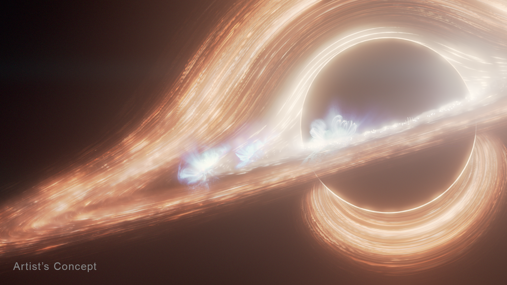

# Formação de Buracos Negros Estelares

A formação de buracos negros estelares representa uma das conclusões mais fascinantes
da física moderna e da cosmologia. Esses objetos celestes resultam de transformações extremas
no ciclo de vida das estrelas de grande massa e exemplificam como a gravidade altera
fundamentalmente a estrutura do espaço e do tempo.

## 1. O Ciclo de Vida Estelar e o Colapso Gravitacional

Durante a maior parte de sua existência, uma estrela permanece em um estado de
equilíbrio dinâmico contínuo. De um lado, a fusão nuclear em seu núcleo gera uma imensa
pressão de radiação orientada para fora; de outro, a atração gravitacional gerada por sua própria
massa puxa todo o material em direção ao centro (HAWKING, 2001).

Quando o combustível nuclear de uma estrela com massa significativamente superior à
do Sol se esgota, a pressão interna de radiação cessa. Sem essa sustentação, a gravidade passa a
dominar de forma irrestrita, provocando o colapso do núcleo (DE SANTI; SANTARELLI,
2019).

Caso a massa remanescente do núcleo após a expulsão das camadas externas - evento
conhecido como supernova - seja grande o suficiente, nenhuma força física conhecida é capaz de
deter a contração. O núcleo colapsa indefinidamente até que toda a sua matéria se concentre em
uma região extremamente reduzida, dando origem a um buraco negro estelar
(SIQUEIRA-BATISTA; HELAYËL-NETO, 2021).

## 2. A Geometria do Espaço-Tempo e o Horizonte de Eventos

De acordo com a Teoria da Relatividade Geral, a gravidade não é uma força invisível
atuando à distância, mas sim uma manifestação da curvatura do espaço-tempo provocada pela
presença de massa e energia (SIQUEIRA-BATISTA; HELAYËL-NETO, 2021).

Ao concentrar uma massa enorme em um volume minimizado, a deformação do
espaço-tempo ao redor torna-se tão pronunciada que estabelece regiões com propriedades
geométricas únicas:

* **Horizonte de Eventos:** É a fronteira imaginária que delimita a região do buraco negro.
Uma vez ultrapassado essa linha de não retorno, a velocidade necessária para escapar da
atração gravitacional supera a velocidade da luz. Como nada no universo pode viajar mais
rápido do que a luz, nada - nem a matéria, nem a radiação - consegue escapar do seu
interior (NEVES, 2020).

* **Singularidade:** Localizada no centro do horizonte de eventos, é o ponto conceitual para
onde toda a massa colapsada foi direcionada. Na singularidade, a densidade e a curvatura
do espaço-tempo atingem valores extremos, sinalizando o limite onde as leis clássicas da
física deixam de descrever o comportamento da matéria (SIQUEIRA-BATISTA;
HELAYËL-NETO, 2021).

*Esta ilustração artística retrata o buraco negro supermassivo no centro da Via Láctea, conhecido como Sagitário A* (A-estrela). Ele é circundado por um disco de acreção giratório de gás quente. A gravidade do buraco negro curva a luz do lado oposto do disco, fazendo com que ela pareça se curvar acima e abaixo do buraco negro. Vários pontos quentes eruptivos, semelhantes a erupções solares, porém em uma escala energética muito maior, são visíveis no disco. O Telescópio Espacial James Webb da NASA detectou tanto erupções brilhantes quanto oscilações mais fracas provenientes de Sagitário A*. As oscilações são tão rápidas que devem se originar muito perto do buraco negro.*

**Ilustração:** NASA, ESA, CSA, Ralf Crawford (STScI). (NASA, 2026).

**Ilustração:** NASA, ESA, CSA, Ralf Crawford (STScI). (NASA, 2026).

## 3. Dinâmica, Estrutura e Observação

Ao contrário da concepção popular de que seriam "devoradores" ativos de tudo ao seu
redor, os buracos negros exercem atração gravitacional idêntica à de qualquer outro corpo celeste
de mesma massa mantido à mesma distância. Sua diferença reside exclusivamente na densidade
extrema e nas propriedades geométricas de seu entorno (PEREIRA; VELÁSQUEZ-TORIBIO,
2024).

Estruturalmente, a maioria dos buracos negros estelares reais possui rotação própria. Essa
rotação arrasta o próprio tecido do espaço-tempo ao seu redor, criando uma região externa ao
horizonte de eventos chamada ergosfera (NEVES, 2020).

Embora o buraco negro em si não emita luz visível, sua presença pode ser detectada
indiretamete por meio do impacto no ambiente ao redor:

* **Disco de Acreção:** Matéria e gás capturados de estrelas vizinhas orbitam o buraco negro a
velocidades próximas à da luz. O atrito interno atinge temperaturas tão elevadas que o
material brilha intensamente, emitindo radiação no espectro de raios X antes de cruzar o
horizonte de eventos (AKIYAMA et al., 2019).
* **Sombra do Buraco Negro:** A gravidade extrema desvia a trajetória da luz emitida pelo
disco de acreção ou por estrelas de fundo. Esse efeito de lente gravitacional projeta uma
silhueta escura central arredondada, conhecida como a sombra do buraco negro (NEVES,
2020).

## 4. Efeitos Quânticos e a Radiação Hawking
Apesar de a gravidade clássica ditar que nada escapa de um buraco negro, a aplicação da
mecânica quântica ao espaço-tempo curvo revelou que eles não são inteiramente negros.

Nas proximidades do horizonte de eventos, flutuações quânticas do vácuo geram
constantemente pares de partículas virtuais. Se uma das partículas cai no horizonte enquanto a
outra escapa para o espaço exterior, o buraco negro perde gradualmente uma fração equivalente
de sua massa (DE SANTI; SANTARELLI, 2019). Esse fenômeno, conhecido como Radiação
Hawking, sugere que, ao longo de prazos cosmologicamente vastos, os buracos negros podem
lentamente evaporar e dissipar toda a sua energia (HAWKING, 2001).

**Sugestão de Conteúdo:** https://youtu.be/nJ4d4QEDOYM?si=Zord9-99QXKDMha4

## Referências

AKIYAMA, Kazunori et al. First M87 Event Horizon Telescope results. I. The Shadow of the Supermassive Black Hole. **The Astrophysical Journal Letters**, v. 875, n. 1, p. L1, 2019.

DE SANTI, Natali Soler Matarubo; SANTARELLI, Raphael. Desvendando a radiação Hawking. **Revista Brasileira de Ensino de Física**, v. 41, n. 3, e20180312, 2019.

HAWKING, Stephen. **O Universo numa Casca de Noz**. Rio de Janeiro: Nova Fronteira, 2001.

NASA. [Hubble's Galaxies](https://science.nasa.gov/mission/hubble/science/universe-uncovered/hubble-galaxies/). **NASA Science**, 2026. Disponível em: <https://science.nasa.gov/mission/hubble/science/universe-uncovered/hubble-galaxies/>. Acesso em: 21 set. 2026.

NASA. [O Web da NASA amplia os limites do Universo observável, aproximando-o do Big Bang](https://science.nasa.gov/missions/webb/nasa-webb-pushes-boundaries-of-observable-universe-closer-to-big-bang/). **Ciência da NASA**, 2026b. Disponível em: <https://science.nasa.gov/missions/webb/nasa-webb-pushes-boundaries-of-observable-universe-closer-to-big-bang/>. Acesso em: 21 set. 2026.

NEVES, Juliano C. S. O buraco negro e sua sombra. **Revista Brasileira de Ensino de Física**, v. 42, e200016, 2020.

PEREIRA, C. C.; VELÁSQUEZ-TORIBIO, A. M. A Terceira Lei de Kepler em diferentes escalas: de luas até galáxias. **Revista Brasileira de Ensino de Física**, v. 46, e2023029, 2024.

SIQUEIRA-BATISTA, Rodrigo; HELAYËL-NETO, José A. Buracos negros estelares: a geometria do espaço-tempo de Schwarzschild. **Cadernos de Astronomia**, v. 2, n. 2, p. 123–131, 2021.
