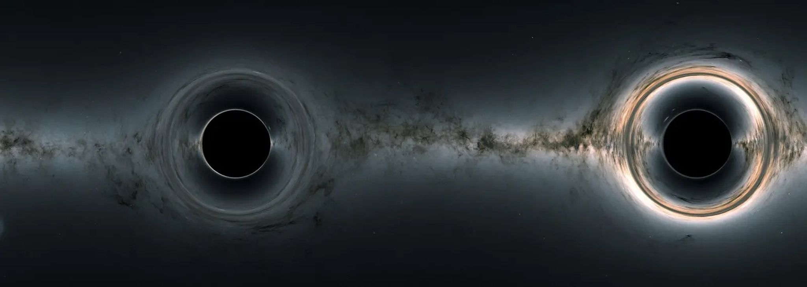
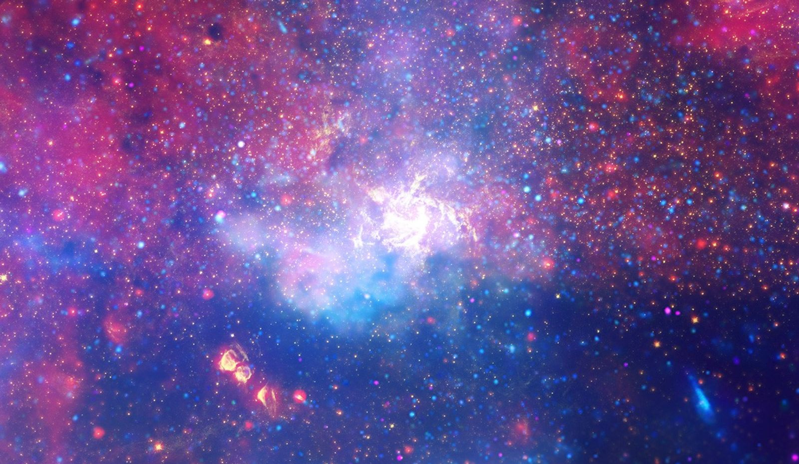
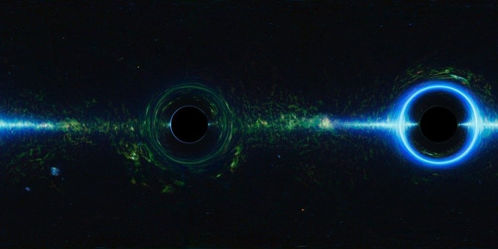
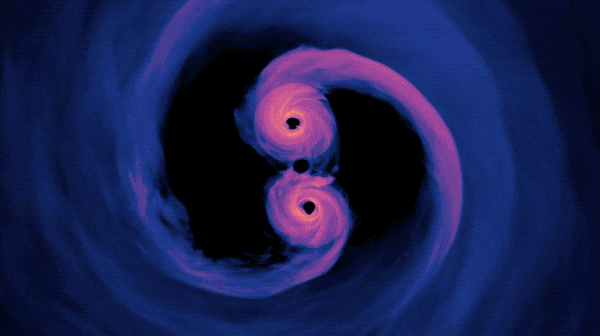
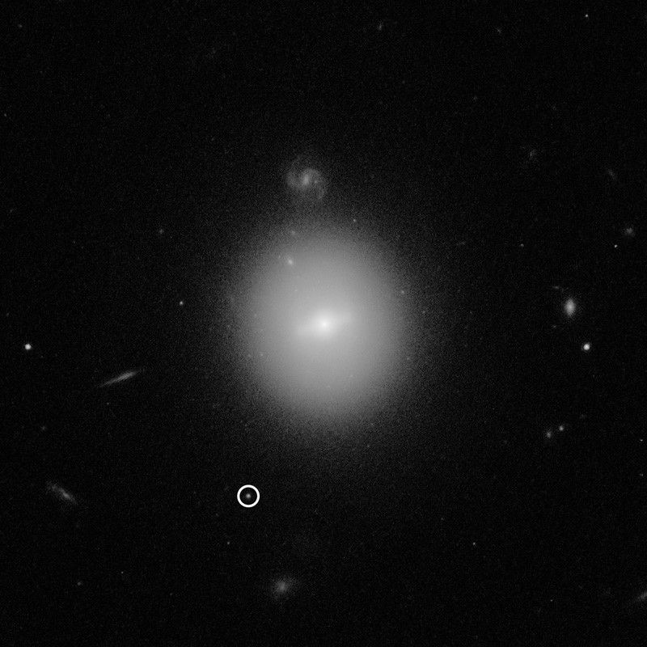

# Tipos de buracos negros

Os astrônomos geralmente dividem os buracos negros em três categorias de acordo com sua massa: massa estelar, supermassiva e massa intermediária. As faixas de massa que definem cada grupo são aproximadas, e os cientistas estão sempre reavaliando onde os limites devem ser definidos. Os cosmólogos suspeitam que um quarto tipo, buracos negros primordiais formados durante o nascimento do universo, também podem estar escondidos no cosmos.

*Um vórtice giratório de gás quente brilha nesta composição de múltiplos comprimentos de onda, marcando a localização aproximada do buraco negro supermassivo Sagitário A\* (pronuncia-se ey-star) no coração da nossa galáxia, a Via Láctea.*

*NASA, ESA, SSC, CXC, STScI*

## Estelar

Quando uma estrela com mais de oito vezes a massa do Sol fica sem combustível, seu núcleo entra em colapso, ricocheteia e explode como uma supernova. O que resta depende da massa da estrela antes da explosão. Se estivesse perto do limiar, criaria uma estrela de nêutrons superdensa do tamanho de uma cidade. Se tivesse cerca de 20 vezes a massa do Sol ou mais, o núcleo da estrela colapsa em um buraco negro de massa estelar.

*Esta imagem simulada mostra como buracos negros curvam um fundo estrelado e capturam luz, produzindo silhuetas de buracos negros. Uma característica distinta, mas difícil de observar, chamada anel de fótons, descreve os buracos negros.*

*Centro de Voos Espaciais Goddard da NASA; antecedentes, NASA/JPL-Caltech/UCLA*

As massas desses objetos recém-nascidos podem variar de algumas a centenas de vezes a massa do Sol, dependendo da massa da estrela quando a supernova começou. Buracos negros de massa estelar podem continuar a ganhar massa através de colisões com estrelas e outros buracos negros.

Quase todos os buracos negros de massa estelar observados até agora foram encontrados porque estão emparelhados com estrelas. Elas provavelmente se originaram como estrelas incompatíveis, onde a mais massiva evoluiu rapidamente para um buraco negro. Em alguns casos, chamados de binários de raios X, o buraco negro puxa o gás da estrela para um disco que aquece o suficiente para produzir raios X. Os binários revelaram cerca de 50 buracos negros de massa estelar suspeitos ou confirmados na Via Láctea, mas os cientistas pensam que pode haver até 100 milhões só na nossa galáxia.

## Supermassivo

Quase todas as grandes galáxias, incluindo a nossa Via Láctea, têm um buraco negro supermassivo no seu centro. Esses objetos monstruosos têm centenas de milhares a bilhões de vezes a massa do Sol, embora alguns cientistas coloquem o limite inferior em dezenas de milhares.

*O gás brilha intensamente nesta simulação computacional de buracos negros supermassivos a apenas 40 órbitas da fusão. Modelos como este podem eventualmente ajudar os cientistas a identificar exemplos reais destes poderosos sistemas binários.*

*Centro de Voos Espaciais Goddard da NASA/Scott Noble*

## Intermediário

Os cientistas estão intrigados com a diferença de tamanho entre buracos negros de massa estelar e supermassivos.

## Primordial

Cientistas teorizam que buracos negros primordiais se formaram no primeiro segundo após o nascimento do universo. Naquele momento, bolsões de material quente podem ter sido densos o suficiente para formar buracos negros, potencialmente com massas variando de 100.000 vezes menores que um clipe de papel a 100.000 vezes maiores que as do Sol. Então, à medida que o universo se expandia e esfriava rapidamente, as condições para a formação de buracos negros dessa maneira terminaram.

## Referências

1. [Black Hole Types — NASA Science](https://science.nasa.gov/universe/black-holes/types/)
2. [Buracos negros e buracos de minhoca? — Museu de Ciências e Tecnologia, PUCRS](https://www.pucrs.br/mct/buracos-negros-e-buracos-de-minhoca/)
